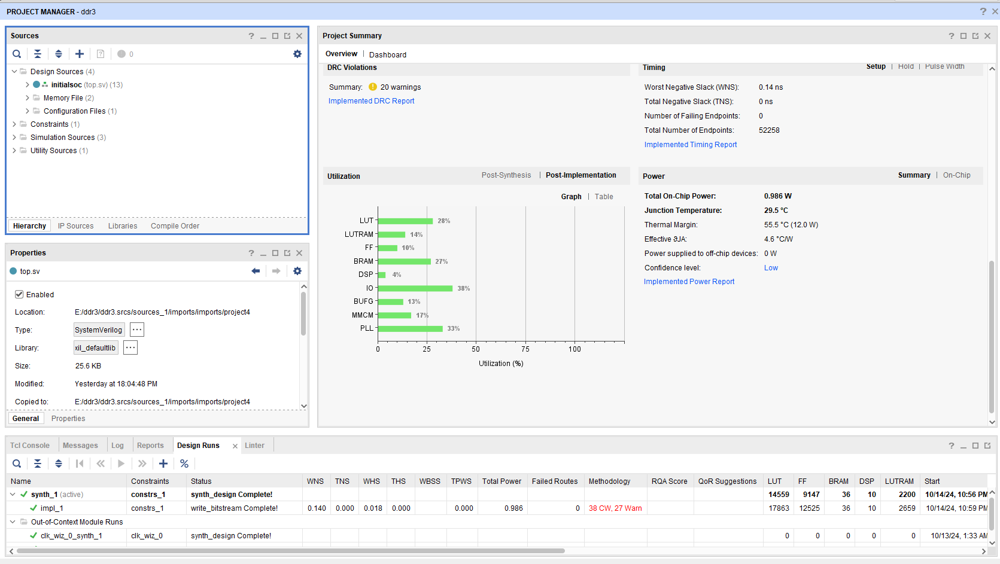

# BiriqIIEC
This is a yet to be fully verified 2-way superscalar, out-of-order speculative **RV32IMB_Zicond_Zifencei_Zicsr_Zicbo_XPSX** implementation with Machine and User support.

With SIMD extensions, the CPU fits to around 10700 LUTs in a Digilent Arty A100T (configured with 128 BTB entries, 32 RAS entries with RAS enabled, 10 store buffer entries and 4 PMP Entries), whilst also running at over 80Mhz (this is at a speed grade of -1).

Above is the the BiriqIIE verbatim from this repository with a DMA, GPIO, UART, SRAM, FLASH, PLIC, CLINT, DDR3 (using Xilinx's MIG with a bridge) and interconnect all attached together.

## Properties:
- A configurable BTB/RAS storing both targets and bimodal prediction counters.
- 8KB I-Cache and 8KB write-through D-Cache, both with 128 byte cache lines, both 2-way set associative.
- Configurable entry Store Buffer/Queue (holds both speculative and commited results).
- A branch mispredict recovery delay of 16 cycles, with backend recovery in parallel with frontend recovery.
- Move elimniation supported using the pseudo-instruction mov present in RISC-V assembler.
- Non-blocking Loads.
- Store Forwarding in the case where one store overlaps any number of bytes in a load.
- 64 physical registers with PR0 mapped permanently to $zero.
- Forwarding for both integer ALU's and branch unit.
- Up to 32 instructions in flight.
- SIMD instructions on both Integer ALU Ports.
- Dual ported, dual issue out of order integer scheduler for maximum effeciency in scheduling integer/branch instructions
- 0, 4, or 8 PMP Entries with a granularity of 128 bytes.
Queue capacities: \
Up to 16 memory/mul/div/csr instructions \
Up to 12 ALU/Branch instructions.

The PMA Map of this core is:\
0x00000000 - 0x7FFFFFFF (inclusive) -> Weakly ordered, idempotent memory (RVWMO)\
0x80000000 - 0xFFFFFFFF (inclusive) -> Weakly ordered/Strongly ordered, non-idempotent memory (RVWMO/SC)

I/O ordering is configurable using MAUX (CSR: 0x7C0) bit 4, allowing I/O loads to execute with disregard to I/O stores (except cases of address overlap)
## Improvements:
- Add ebreak into decoder (done)
- Make divider and multiplier out of pipe (done)
- Add in timeout wait (done)
- Fix RAS (done)
- Fix the load pipeline, and improve non-blocking cache (done)
- Make LUI run on both Integer Ports. (done)
- Make Data Cache 64-bit (done).
- Add configurable PMAs
- Add PMP for NAPOT only (done)
- Add atomic instructions for both IO and non IO regions
- Make dcache/icache more bus agnostic to enable different bus implementations (AXI, AHB, Wishbone)
- Make more parameters configurable

This core supports a regular TileLink Uncached Heavyweight bus at 32-bit data width, and 32-bit address width.

This core is licenced under the CERN OHL v2.0 - Weakly Reciprocal.