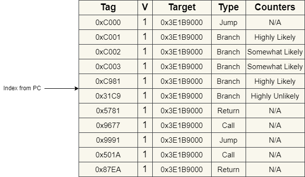

# Frontend

The frontend is in-order and consists of the following stages:
- PC Generation
- Instruction Cache access
- Decode

## General overview
The frontend does not predict individual branches but rather predicts instructions packets. An instruction packet is simply just
two instructions at a 64-bit aligned address. The frontend predicts which instructions are the actual taken branch inside a packet and
masks off any instructions that are predicted not to be executed.

## PC Generation:
During PC generation, a tag is produced from some of the upper 29 bits of the program counter and compared against BTB entries at an index
produced from the remaining bits of the PC. 

The logic then selects from one of the matching two ways and this produces a branch target address, a branch index
(which instruction is the branch), branch type info (whether it is an unconditional jump, a call, a conditional branch or a return), and
a bimodal prediction counter (only ever used for conditional branches). 

This information is then submitted together with the current
program counter to the instruction cache, and if the branch is taken the branch target becomes the new program counter value.

In the case of a return, instead of sourcing the branch target from the BTB, the Return Address Stack is used. The Return Address Stack is simply a 30-bit RAM, of configurable depth, indexed by a counter that can wrap around and is recovered on a misprediction. 

A stylised Branch Target Buffer looks as so:

## Instruction Cache Access

This stage is responsible for producing a set of 2 instructions from its internal SRAM, and if the cache line isn't present it will then fetch it from memory.

The cache is 2-way set associative, with a cache line size of 128 bytes, containing 64 sets, at 32 sets per way. It uses a random replacement policy when both sets are used at an index. The cache cannot be turned off.

## Decode

This stage takes a RISC-V instructions and translates them into the necessary control signals that the CPU's backend can easily use. This mainly applies
to the RISC-V arithmetic instructions, which are translated from their func7/func3 forms into a standard encoding used by the CPU's backend.

Also detected here are ECALL and EBREAK, which are translated into the appropriate exception code.

Another type of instruction detected in the decode stage is move eliminations. These are encoded in RISC-V as

`addi rd, rs1, 0`

This type of instruction only changes the reference to the architectural register from what rd was before to what rs1 was pointing to.

Another duty of the decoder is to mask off any instructions predicted not to be executed or not supposed to be executed (i.e. either if the PC value is only 4-byte aligned, or the instruction is predicted not be executed from a branch just before it).

If the decoder detects that a branch has been predicted in an address where no branch existed before the decoder is able to flush the processor frontend and re-steer it to the correct address and invalidate the incorrect entry in the BTB.