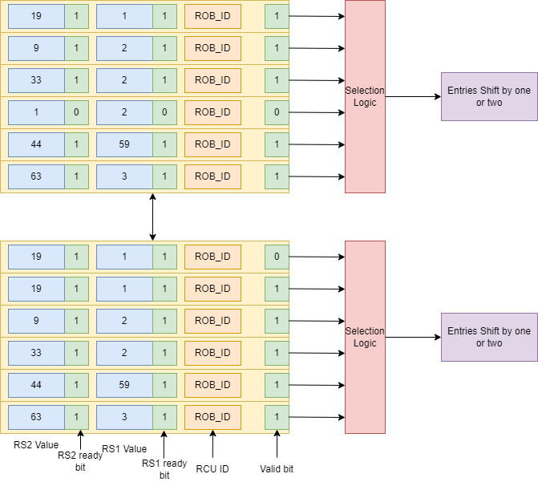

# Mathematics Execution Unit

This part of the CPU is responsible for the Scheduling, Operand Fetch and Execution of most integer operations.

This part of the CPU alone executes all non-Memory and non-System operations including branches, and executes all instructions from the PSX extension, Zicond, Zba, Zbb, and Zbs.

## Unified Integer Queue
This part of the MEU holds instructions due for execution, uniquely identified at any given cycle with their RCU number.\
The Unified Integer Queue is a dual-enqueue, dual-dequeue and dual-compacting scheduler. This means it stores entires in age order, considering older instructions before considering newer ones. Despite the cost of the scheme compared to a simpler free-slot scheduler, it is well worth it due to the earlier execution of older instructions compared to the age-agnostic free slot scheme. It also frees up to two slots every cycle.

Note that every instruction that goes through this unit is a single cycle instruction, regardless of whether it is a branch/alu/simd instruction. This includes complex instructions like clz/ctz/cpop. All instructions except LUI, AUIPC, and Branches are executable on both Integer ports. (I'm planning to let LUI run on both ports)

## IRAM
This RAM holds information regarding the destination register, instruction, immediate, whether the instruction uses the immediate etc.

## Binfo
Branch info RAM holds the branch prediction information from the BTB, and the PC of an instruction.
